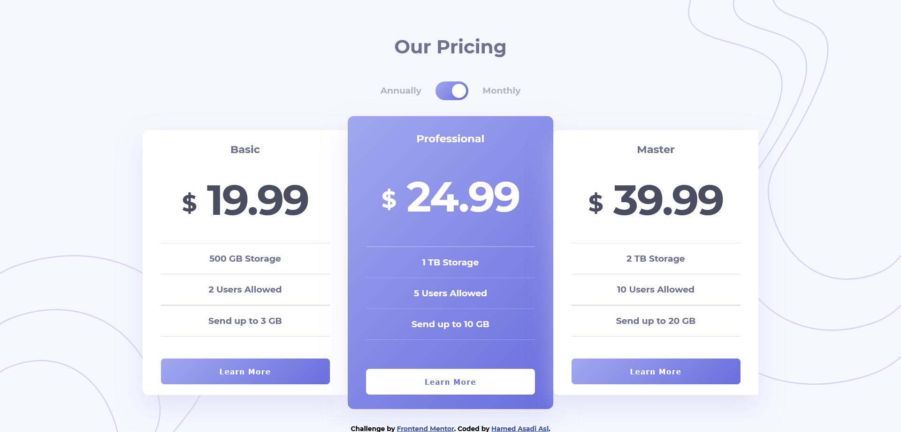

# Frontend Mentor - Pricing component with toggle solution
This is a solution to the [Pricing component with toggle challenge on Frontend Mentor](https://www.frontendmentor.io/challenges/pricing-component-with-toggle-8vPwRMIC).

Users should be able to:
- View the optimal layout for the component depending on their device's screen size
- Control the toggle with both their mouse/trackpad and their keyboard
- **Bonus**: Complete the challenge with just HTML and CSS

### Screenshot

### Links
- Live Site URL: [live "Pricing component" URL here](https://hamed3958.github.io/pricing-component-with-toggle/)

### Built with
- Semantic HTML5 markup
- CSS custom properties
- Flexbox
- JavaScript interactive behavior

### Continued development
I want to continue to complete the challenge with just HTML and CSS. This is a technique I'm still not completely found it, that I want to refine and perfect.

## Author
- Website - [hamedasadiasl.ir](http://hamedasadiasl.ir/)
- Github - [@hamed3958](https://github.com/hamed3958)
- Frontend Mentor - [@hamed3958](https://www.frontendmentor.io/profile/hamed3958)
